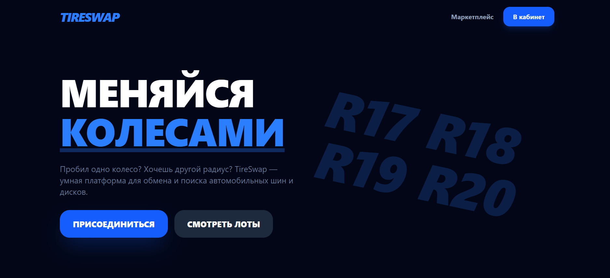
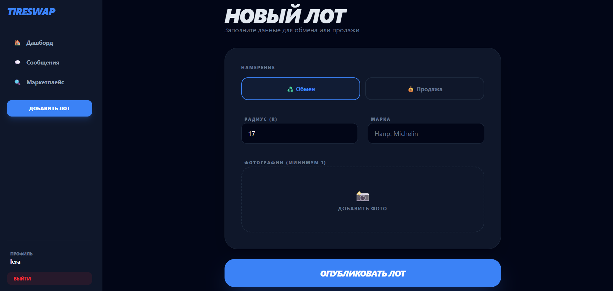
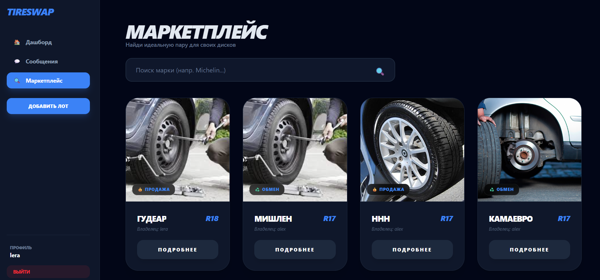
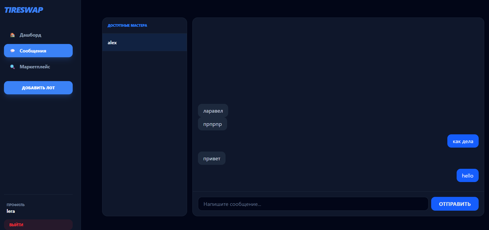
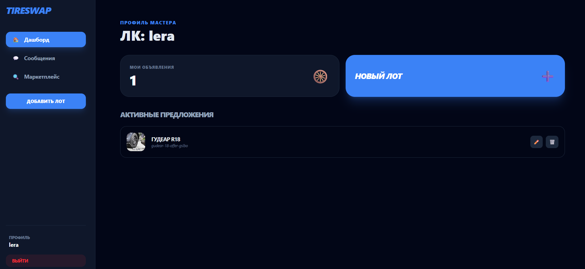

# 🛞 TireSwap

**TireSwap** — современный узконишевый маркетплейс для поиска и обмена автомобильных колес. Проект создан для решения проблемы «одиночного колеса» и быстрого обмена шин/дисков между мастерами.

## 📸 Скриншоты интерфейса

<div align="center">
  
  
  
  
  
  
</div>

## ⚡️ Технологический стек (Modern 2026)
*   **Framework:** Laravel 13
*   **Frontend:** Livewire 4 + Volt (Class-style components)
*   **Styling:** Tailwind CSS v4 (с поддержкой `@source` и нативных переменных)
*   **Real-time:** Laravel Reverb (WebSockets) для мгновенного чата
*   **Database:** MySQL 8.0 (использование Slugs для SEO и Spatial данных для геопозиции)
*   **Environment:** Laravel Sail (Docker / WSL2)

## 🌟 Основной функционал
- ✅ **Публичный Маркетплейс**: Просмотр всех объявлений гостями с живым поиском (debounce).
- ✅ **Личный кабинет**: Управление своими лотами (создание, редактирование, удаление).
- ✅ **Real-time Chat**: Полноценная система обмена сообщениями без перезагрузки страницы.
- ✅ **Умная загрузка фото**: Поддержка форматов WebP/AVIF, валидация расширений и предпросмотр.
- ✅ **SEO-Friendly**: Автоматическая генерация уникальных URL-адресов (slugs) для каждого лота.
- ✅ **Mobile First**: Адаптивная верстка с мобильным меню-бургером и нижней навигацией.

## 🛠 Установка и запуск

1. **Клонирование проекта:**
   ```bash
   # 1. Клонирование и вход в директорию
git clone https://github.com/Laracoper/tireswap.git
cd tireswap

# 2. Установка зависимостей через временный контейнер
docker run --rm -v $(pwd):/var/www/html -w /var/www/html laravelsail/php84-composer:latest composer install

# 3. Запуск инфраструктуры (Sail)
./vendor/bin/sail up -d

# 4. Настройка окружения
./vendor/bin/sail artisan key:generate
./vendor/bin/sail artisan migrate --seed
./vendor/bin/sail artisan storage:link

# 5. Сборка фронтенда и запуск сокетов
./vendor/bin/sail npm install
./vendor/bin/sail npm run dev & ./vendor/bin/sail artisan reverb:start

